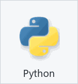
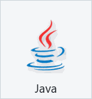
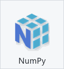
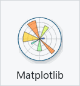
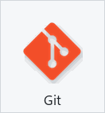

# Hi, I'm Ermelo Vinas Jr.

Master's student in Information Engineering and Computer Science, building practical projects in image processing, data structures, and AI-assisted development.

## Current Focus

- Implementing image processing algorithms from first principles
- Strengthening data structures and algorithmic problem solving in C and Java
- Building a clearer portfolio around coursework, experiments, and applied software projects

## Tech Stack

### Languages

  
  
  
  

### Image Processing

  
  
  
  

### Tools and Systems

  
  
  
  

- Interests: AI-assisted development, computer vision, software engineering, data structures

## Featured Coursework

### 1335 Image Processing

- [Manual Histogram Equalization](https://github.com/melovinasjr/manual-histogram-equalization): manual histogram computation, CDF equalization, RGB equalization, and brightness-based enhancement.
- [Manual Canny Edge Detection](https://github.com/melovinasjr/manual-canny-edge-detection): full Canny pipeline implemented without `cv2.Canny`.
- [Interactive Graph Cut Segmentation](https://github.com/melovinasjr/interactive-graph-cut-segmentation): foreground/background segmentation using user seeds, GMMs, graph construction, and min-cut optimization.

### 1279 Data Structures

- [Maze Search](https://github.com/melovinasjr/maze-search): stack-based maze pathfinding in C.
- [Matrix Search Benchmark GUI](https://github.com/melovinasjr/matrix-search-benchmark-gui): Java Swing benchmark for sequential, binary, and hash-based search.
- [Sparse Matrix Operations](https://github.com/melovinasjr/sparse-matrix-operations): sparse matrix triplet operations with C and Java JNI.
- [Stack Expression Converter](https://github.com/melovinasjr/stack-expression-converter): infix, postfix, prefix conversion and expression evaluation with C and Java JNI.
- [Linked List Polynomial Application](https://github.com/melovinasjr/linked-list-polynomial-application): polynomial equation manager using linked lists in C.

See the grouped index: [Academic Coursework](https://github.com/melovinasjr/academic-coursework)

## Contact

- Email: melovinasjr@gmail.com
- LinkedIn: https://www.linkedin.com/in/ermelovinasjr/
- Portfolio: https://melo-portfolio.onrender.com/
